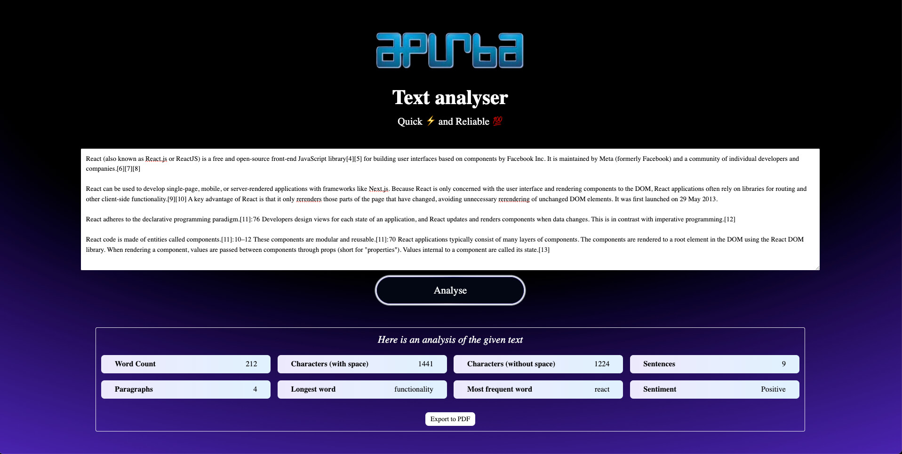
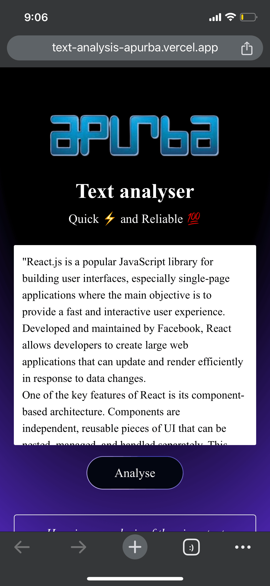
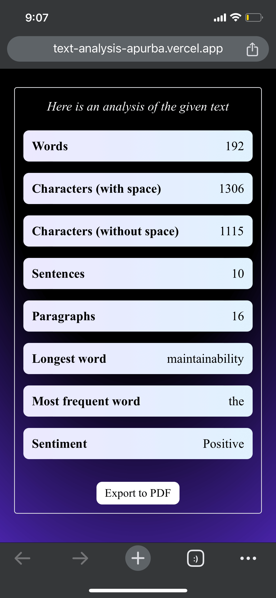

# Text Analysis Application

**Deployed Project**: [https://text-analysis-apurba.vercel.app/](https://text-analysis-apurba.vercel.app/)

## 📝 Brief Description

The Text Analysis Application developed for Apurba is a powerful tool designed to analyze text by providing key metrics such as word count, character count, sentence count, and more. Whether you're working on a research paper, writing an article, or simply curious about the content of your text, this application provides instant insights with a sleek and user-friendly interface. Additionally, the application offers an option to export the analysis results to a PDF file for easy sharing and record-keeping.

## 📸 Screenshots

### Desktop View



### Mobile View

<p align="center">
  
  
</p>

## 🚀 How to Run Locally

### Using npm

1. **Clone the repository:**

   ```bash
   git clone https://github.com/furqan-qadri/text-analysis-apurba
   cd text-analysis-app

   ```

2. **Install dependencies:**

   ```bash
   npm install

   ```

3. **Start the development server:**

   ```bash
   npm run dev

   ```

4. **Open your browser and navigate to:**
   ```bash
   http://localhost:5173
   ```

## ⛴️ Using Docker

1. **Build the image**

   ```bash
   docker build -t apurba-text-analysis .

   ```

2. **Run the Docker container:**

   ```bash
   docker run -p 8080:80 text-analysis-apurba

   ```

3. **Open your browser and navigate to:**
   ```bash
   http://localhost:8080
   ```

## 🛠️ Techniques Used

React + TypeScript: The application is built using React, leveraging TypeScript for type safety and code maintainability.

Vite: The project uses Vite for a fast and optimized development experience.

Tailwind CSS: Tailwind CSS is used to create a responsive, modern, and visually appealing design.

Playwright for Testing: End-to-end tests are implemented using Playwright to ensure the reliability of core features.

Docker: The application is containerized using Docker, making it easy to deploy and run in any environment.
